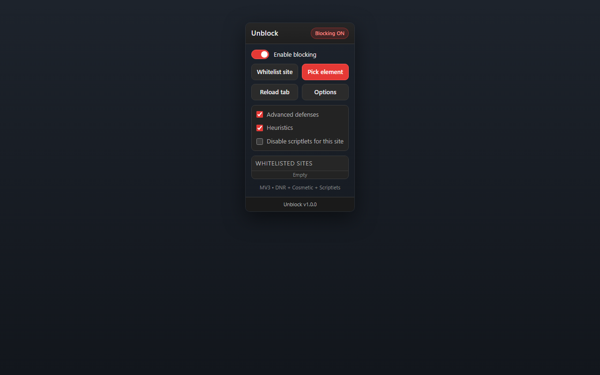
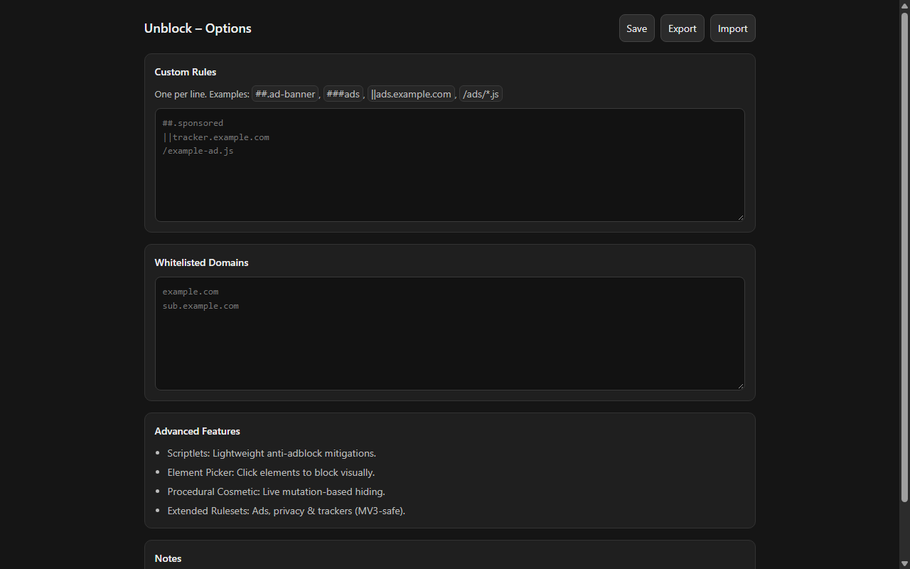
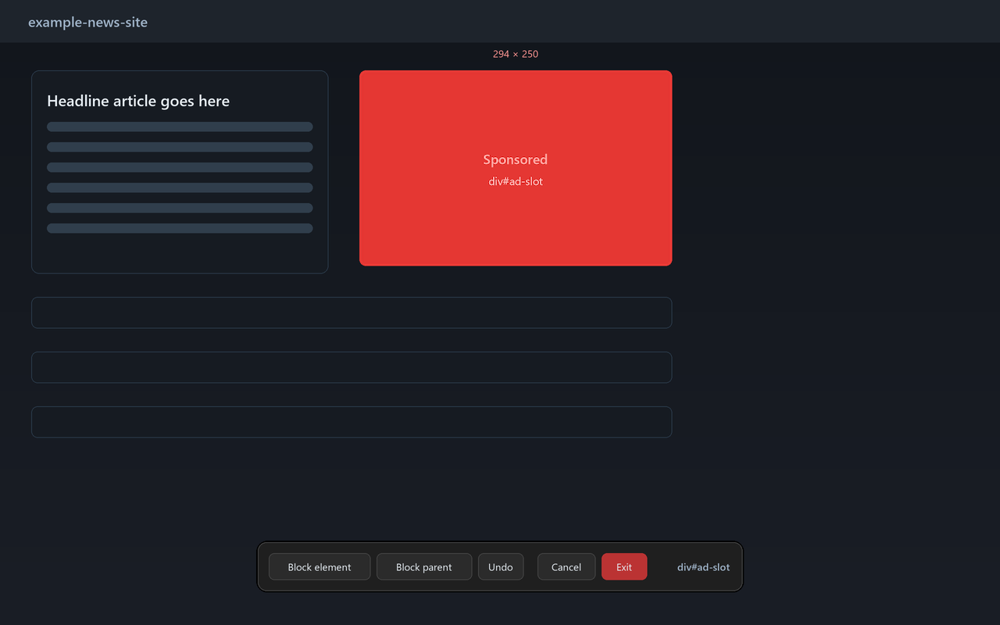

# Unblock

> Lightweight, privacy-first MV3 content blocker. Inspired by uBlock Origin, restructured and optimized for Chromium Manifest V3 with practical trade-offs clearly documented.

[](./manifest.json)
[](./LICENSE)
[](https://developer.chrome.com/docs/extensions/develop/migrate)

## Table of Contents

- [Overview](#overview)
- [Screenshots](#screenshots)
- [Features](#features)
- [Limitations vs uBlock Origin (Full)](#limitations-vs-ublock-origin-full)
- [Installation](#installation)
- [Quick Start](#quick-start)
- [Usage Guide](#usage-guide)
- [Project Structure](#project-structure)
- [Technical Architecture](#technical-architecture)
- [Security & Privacy](#security--privacy)
- [Performance](#performance)
- [Testing](#testing)
- [Troubleshooting](#troubleshooting)
- [Roadmap](#roadmap)
- [Contributing](#contributing)
- [License](#license)
- [Acknowledgments](#acknowledgments)

## Overview

**Unblock** is a Manifest V3 (MV3) content blocker focused on delivering strong baseline protection while remaining predictable, auditable, and maintainable. It combines static network filtering (DNR), heuristic cosmetic hiding, a minimal scriptlets engine, and an element picker to block ads, trackers, and intrusive elements with minimal overhead.

Due to Chromium MV3 constraints, Unblock does **not** aim to be a 1:1 port of uBlock Origin. Instead, it implements the subset of features that remain practical and reliable under MV3, with limitations documented transparently.

## Screenshots

### Popup



### Options



### Element Picker



The popup and options shots are real captures of the shipped UI taken in
headless Chrome (`node tools/shot-ui.js`); the element-picker shot is a
generated preview (`python tools/generate-store-assets.py`).

## Features

### Core Blocking
- **Static Network Filtering** – Uses `declarativeNetRequest` (DNR) with curated, MV3-safe rule sets.
- **Multi-List Coverage** – Bundled rule resources: `default-block`, `ads-lite`, `privacy-lite`, `trackers-lite`.
- **Domain Whitelisting** – Per-site allowlist with persistent storage. Every rule is `thirdParty`-scoped, so a site's own requests are never blocked by its ad filters.
- **Resource-Type Aware** – Rules target script, image, XHR, sub_frame, font, stylesheet and friends. `media`, `other`, `object` and `main_frame` are deliberately excluded so video streaming is never interrupted.

### UI & Control
- **Popup UI** – Toggle blocking, allow/block current site, view/manage whitelist, launch Element Picker.
- **Options Page** – Manage custom rules & whitelist, import/export configuration as JSON.
- **Element Picker** – Visually select elements to block (generates CSS selector `##...` and saves to Custom Rules).
- **State-Aware Icon** – Color when active, grayscale when disabled.

### Advanced
- **Scriptlets Engine** – Minimal, safe subset covering common anti-adblock defenses:
  - `no-adblocker` – Neutralizes common adblock detection globals
  - `set-constant` – Locks values to avoid bait/telemetry toggles
  - `json-prune` – Prunes sensitive JSON paths
  - `remove-attr` – Removes tracking attributes dynamically
  - `prevent-setTimeout` / `prevent-setInterval` – Throttles known timer-based bait
  - `no-eval-if` – Blocks eval when pattern matches
- **Procedural Cosmetic Filtering** – MutationObserver-driven heuristic hiding with WeakSet deduplication (catches dynamically injected ad slots).
- **Auto-Site Mitigations** – Lightweight baseline scriptlets applied at `document_start` (YouTube-focused safe defaults, generic fallback).

## Limitations vs uBlock Origin (Full)

| Capability | Unblock (MV3) | uBlock Origin (Full, MV2/Firefox) | Notes |
|---|---|---|---|
| Dynamic Filtering | No | Yes | DNR is static; real-time per-request allow/block unavailable in MV3. |
| Full Scriptlets (`##+js(...)`) | Partial (subset) | Full | Only curated, low-risk scriptlets implemented. Complex procedural scriptlets omitted. |
| `removeparam=` | Not implemented | Yes | Not mappable to safe DNR primitives. |
| `redirect=` / `redirect-rule=` | Not implemented | Yes | Blocked/redirect-if-blocked unsupported by DNR. |
| `replace=` (response body) | Not supported | Limited/Firefox | Requires full response interception (impossible in MV3). |
| CNAME Uncloaking | Not supported | Varies | Not exposed via DNR. |
| Real-Time Request Logger | No | Yes | MV3 lacks live `webRequest` stream access required for full logger. |
| Element Picker Coverage | Good (CSS-based) | Excellent | Selector depth limited (depth<=4, class-trim) to avoid overly brittle selectors. |
| Max DNR Rules | Browser-limited | N/A | Rules are split across 4 resources; total count still constrained by Chromium. |

> Unblock prioritizes **stability, predictability & privacy** over maximum filter expressiveness.

## Installation

### Load Unpacked (Development/Testing)

1. Open `chrome://extensions/` in Chromium (Chrome, Edge, Brave, etc.)
2. Enable **Developer mode** (top-right)
3. Click **Load unpacked**
4. Select folder: `D:\Project\ublock-origin` (contains `manifest.json`)
5. Unblock extension appears. Click to open popup.

> Note: MV2-based original uBO cannot run on modern Chrome. Unblock is MV3-native by design.

## Quick Start

1. Install via Load Unpacked
2. Ensure toggle ON (icon colored). Visit a site with ads → should be reduced.
3. Problematic element? Popup → **Pick element** → click element → saved to Custom Rules.
4. Broken site? Popup → **Allow this site** (whitelist) or toggle OFF temporarily.
5. Tweak: `chrome-extension://<id>/options.html` → Custom Rules/Whitelist/Import-Export.

## Usage Guide

### Popup
- **Enable blocking**: Master toggle. Persists across sessions.
- **Block this site**: Informational (static DNR; use Custom Rules/Element Picker for per-site cosmetic).
- **Allow this site**: Adds current hostname to whitelist (network+cosmetic heuristics remain passive on allowlisted context; scriptlets still run at document_start but are low-risk; consider toggling OFF if site breaks critically).
- **Pick element**: Injects picker overlay, highlights hovered element, saves generated selector as `##<selector>`.
- **Whitelisted**: Remove entries with Remove.

### Options
- **Custom Rules**: One per line. Supported forms:
  - Cosmetic hide: `##.class`, `###id`, `##div > .ad`
  - Domain block (DNR): `||example.com`, `||ads.example.net`
  - Path pattern: `/ads/`, `/banner*.js`
  - Comments: lines starting `#` are ignored on import (fromText filters `#`)
- **Whitelist**: Hostnames (exact). Applied at runtime context (UI only; DNR allowlisting not auto-generated here to avoid rule bloat).
- **Import/Export**: JSON `{customRules[], whitelist[], exportedAt}` or paste raw rules text.

### Element Picker Behavior
- Traverses up to depth 4, prefers ID if present, else tag + up to 2 classes (CSS-escaped).
- Adds `data-unblock-hidden` + `display:none !important` via cosmetic layer when applied.
- Picker self-cleans on Escape/Cancel/Exit/click.

### Scriptlets Notes
- Run at `document_start` (ISOLATED world). Designed defensive-only (no arbitrary remote eval).
- Auto-applied: YouTube gets extra safe constants + `no-adblocker`; others get `no-adblocker` baseline.
- Extendable via `window.__uboScriptlets.run([...])` if needed (internal API).

## Project Structure

```text
D:\Project\ublock-origin/
├── manifest.json           # MV3 manifest (Unblock)
├── README.md               # User/dev docs (this file)
├── css/
│   ├── options.css         # Options styling
│   ├── picker.css          # Element picker overlay
│   └── popup.css           # Popup styling
├── LICENSE                 # MIT
├── PRIVACY.md              # Privacy policy (no telemetry)
├── docs/
│   └── index.html          # GitHub Pages documentation
├── icons/                  # PNG icons (color + gray, shield & u glyph)
├── js/
│   ├── background.js       # SW: settings, messages, whitelist DNR, icon
│   ├── content.js          # Cosmetic selectors + auto scriptlets + picker bridge
│   ├── cosmetic-advanced.js# Procedural cosmetic + generic heuristics
│   ├── main-guard.js       # MAIN-world popup / new-tab guard (self-healing)
│   ├── options.js          # Options logic (save/import/export)
│   ├── picker.js           # Element picker (injected)
│   ├── popup.js            # Popup logic + picker trigger
│   └── scriptlets.js       # Scriptlets registry + runner
├── rules/
│   ├── ads-lite.json       # Ad domains/paths (DNR)
│   ├── default-block.json  # Baseline block rules
│   ├── privacy-lite.json   # Privacy/tracking
│   └── trackers-lite.json  # Trackers/analytics
├── store/                  # Chrome Web Store assets (icons, screenshots, listing)
├── tools/
│   ├── fix-rules.py        # Normalise rule conditions (thirdParty, media-safe)
│   ├── generate-icons.py   # Regenerate icons/ (16-512, color + gray)
│   ├── generate-store-assets.py
│   ├── pack.py             # Build dist/unblock-<version>.zip
│   ├── shot-ui.js          # Real popup/options screenshots (headless Chrome)
│   ├── test-main-guard.js  # Offline guard regression harness
│   └── verify.py           # Verify source tree or package
└── ui/
    ├── options.html        # Options page
    └── popup.html          # Popup
```

## Technical Architecture

### Network Layer (DNR)
- Declarative, no persistent SW wake churn for blocking (matches MV3 efficiency goal).
- Rule resources split by category (priority 1). IDs are namespaced (1–10 default, 100+ ads, 200+ privacy, 300+ trackers). Deterministic, easy to audit.
- `urlFilter` + `resourceTypes` minimize overblocking. Uses `||` domain anchors where appropriate.
- Every rule carries `domainType: "thirdParty"`. Without it, a site whose own API lives on a matching host (`events.*`, `collect.*`, `pixel.*`) has its own requests blocked, which presents as "it worked once, then the site stopped responding".
- `media`, `other`, `object` and `main_frame` are stripped from all rules by `tools/fix-rules.py`, and `tools/verify.py` fails the build if they reappear.
- The dynamic per-domain allowlist uses `allowAllRequests` at priority 99 (IDs `1000+`), so it always wins over the static block rules.

### Popup / New-Tab Guard (MAIN world)
- `js/main-guard.js` runs at `document_start` in `world: "MAIN"`. An ISOLATED-world guard cannot see the page's real `window.open`, so this file must stay in MAIN.
- Installed once per document behind `__unblockGuardInstalled__`, so re-injection never stacks listeners.
- `window.open` is a self-healing accessor: page code assigning over it is ignored, and it is re-sealed for the first seconds plus on `pageshow` (BFCache restores).
- `window.open(url)` is blocked unconditionally; `location.assign/replace` and anchor navigation are only cancelled for URLs matching an ad pattern.
- The DOM guard uses `preventDefault()` + `stopPropagation()` only, never `stopImmediatePropagation()`, so player and SPA listeners keep working.
- Media controls are exempted on the target and its ancestors, with the exemption deliberately bounded (few hops, small subtree) so a page-level wrapper that merely contains a video cannot exempt the whole site.
- Regression harness: `node tools/test-main-guard.js`.

### Cosmetic Layer
1. **Static**: Content scripts run at `document_start` (early). `cosmetic-advanced.js` registers generic selectors + observer.
2. **Procedural**: MutationObserver + `requestAnimationFrame` coalescing + WeakSet to avoid re-hiding. Observes `childList`/`subtree` only, not every attribute.
3. **Picker**: Injected on demand (script injection from popup) to keep base context small.

> Selectors are anchored (`[class^="ad-"]`, `[title="Sponsored"]`) rather than substring matches. `[class*="ad-"]` also matches `read-more` and `download-list`, and `[aria-label*="ad" i]` matches "Add to playlist" and "Download" — loose matching silently hides pagination and player controls. Video, audio, source, track and anything with `controls` are never hidden.

### Scriptlets Layer
- Registry pattern (`SCRIPTLETS` map) + defensive try/catch, minimal surface.
- ISOLATED world avoids conflicts; no global pollution beyond internal `__uboScriptlets`, `__uboCosmetic`.
- Bundled scriptlets: `no-adblocker`, `prevent-popads-net`, `prevent-window-open`.
- Auto mitigations conservative (avoid breaking playback unnecessarily).

### Storage
- `chrome.storage.local` key `unblock_settings`.
- Settings: `{enabled, whitelist[], customRules[], cosmeticSelectors[], scriptletsAllowlist[], advancedDefenses, heuristicsEnabled}`.
- Whitelist entries survive restarts and disable all filtering for that domain until removed. The popup shows a "Paused on this site" state, highlights the current entry, and offers both a per-domain toggle and "Clear all".

### Messaging
- Runtime messages: `getSettings,toggle,addWhitelist,removeWhitelist,clearWhitelist,saveCustomRules,addCustomRule,setAdvancedDefenses,setHeuristics,toggleScriptletsAllowlist,startPicker`.
- Window postMessage bridge for picker injection (safe origin same-page).

## Security & Privacy

- **No remote code**: All JS/CSS/JSON local. No CDN execution, no telemetry.
- **Least Privilege**: Permissions scoped (DNR, storage, tabs/activeTab/scripting, userScripts). `host_permissions: <all_urls>` required for DNR + content scripts.
- **Defensive Coding**: try/catch, null checks, selector guards, CSS.escape, depth limits.
- **No Data Exfiltration**: No network calls, no analytics, no external requests.
- **Import Safety**: JSON/text import validated (try/catch), non-rule lines trimmed/filtered.
- **XSS Hygiene**: Popup/options use textContent/DOM creation, not innerHTML for untrusted dynamic strings (whitelist items use escaped text).

## Performance

- **CPU**: DNR offloads to browser; observer uses rAF coalescing; WeakSet avoids loops on known-hidden.
- **Memory**: WeakSet (no manual cleanup leaks), small registries, injected picker removed on exit.
- **Latency**: `document_start` for cosmetic/scriptlets reduces CLS/FOUT from ads.
- **Rules Bloat**: 4 split resources, curated (~60–70 rules total) vs 10k+ EasyList (intentional MV3 trade-off). Can extend via Custom Rules.

## Testing

### Automated Checks
```bash
node tools/test-main-guard.js          # guard regression harness (21 assertions)
python tools/verify.py .               # validate the source tree
python tools/pack.py                   # build dist/unblock-<version>.zip
python tools/verify.py dist/unblock-1.0.0.zip
```

`verify.py` enforces Manifest V3 shape, that every manifest-referenced file exists, that all rules parse, are uniquely id'd, `thirdParty`-scoped and free of risky resource types, that every shipped `.js` passes `node --check` and contains no `eval`/remote import/legacy branding, and that icons are square PNGs at their declared sizes.

### Manual Smoke Tests
- [ ] Load unpacked, no manifest errors (`chrome://extensions` → Errors: none)
- [ ] Toggle ON/OFF → icon updates, blocking state correct
- [ ] Whitelist current site → status shows "Paused on this site", "Unblock this site" reverses it, entry persists across restarts, "Clear all" empties the list
- [ ] **Refresh the same page 3+ times** — blocking must still be active on every refresh, not just the first
- [ ] **Play a video, then advance to the next video** — playback keeps working and popups stay blocked
- [ ] BFCache: navigate away and back → guard still sealed
- [ ] Element Picker: hover highlights, click saves `##...`, element hidden after reload/apply
- [ ] YouTube: playback stable, fewer ad slots (scriptlets baseline)
- [ ] Dynamic sites (infinite scroll): pagination and "read more" links are still visible and clickable
- [ ] Import/Export JSON + raw text
- [ ] Options/popup responsive, no console errors

### JSON Validation
```bash
python -m json.tool manifest.json
python -m json.tool rules/*.json
```

### Basic Lint (optional)
- JS: no unused vars, no `eval`, uses const/let, try/catch safe
- CSS: BEM-light, z-index 2^31-1 for overlays
- HTML: semantic, CSP-friendly (no inline JS except safe DOM)

## Troubleshooting

| Issue | Cause | Fix |
|---|---|---|
| Manifest load fails | Wrong folder selected | Load unpacked from folder containing `manifest.json` (`D:\Project\ublock-origin`) |
| **"It works on the first load, then does nothing"** | The site was whitelisted during an earlier test — `allowAllRequests` for that domain persists forever | Popup shows "Paused on this site" → click "Unblock this site", or "Clear all" |
| **Blocks the first time, then the site breaks on reload / next video** | Overblocking: loose cosmetic selectors or non-`thirdParty` DNR rules hitting the site's own requests | Selector lists are now anchored and every rule is `thirdParty`-scoped with `media` stripped; re-run `python tools/fix-rules.py` and reload the extension |
| **Next video does not play** | The guard stopped event propagation, or the video host matched a block rule | The guard only uses `preventDefault()`/`stopPropagation()` (never `stopImmediatePropagation`); media controls are exempted with a bounded exemption |
| Popups/new tabs still appear | Page replaced `window.open` after `document_start` | The accessor re-seals itself for the first seconds and on `pageshow`; if a site still escapes it, report the URL |
| Picker doesn't appear | Tab not reloaded / injection blocked | Close popup, ensure page active, click "Pick element" again (uses scripting.executeScript) |
| Site broken after block | Overblocking | Popup → "Whitelist site". Or Options → remove overly broad Custom Rule. |
| Icons missing | Corrupted PNG | `python tools/generate-icons.py` |
| Rules not applying | Extension disabled/reloaded | Reload extension (`chrome://extensions` → Reload), hard refresh page (Ctrl+Shift+R) |
| DNR limit warnings | Too many custom/static rules | Trim unused Custom Rules, avoid extremely broad `||` without resourceTypes, split lists. |

## Audit Summary (What Was Cleaned/Fix/Optimized)

### Cleaned Up
- Renamed branding to **Unblock** (name/short_name/author/description, UI, README, docs)
- Consistent naming: internal IDs unchanged, comments minimal (no comments per code style)
- Removed legacy naming (`uBO-Lite`, `Pro`) from UI text where redundant
- Organized assets, added `docs/` for GitHub Pages

### Fixed
- **Blocking stopped working on the second refresh / on the next video.** Three independent causes:
  1. A whitelisted domain gets a persistent `allowAllRequests` dynamic rule, so the site stays unblocked forever. The popup now shows "Paused on this site", turns the button into "Unblock this site", highlights the current entry, and adds "Clear all".
  2. Cosmetic selectors used substring matching. `[class*="ad-"]` matches `read-more` and `download-list`; `[aria-label*="ad" i]` matches "Add to playlist", "Download" and "Headphones". Selectors are now anchored/exact, and media elements are never hidden.
  3. DNR rules had no `domainType`, so a site whose own API lives on a matching host (`events.*`, `collect.*`, `pixel.*`) blocked its own requests, and rule 1 included `media`/`other`/`object` which can kill video segments. All rules are now `thirdParty`-scoped and media-safe, enforced by `verify.py`.
- The popup guard moved from the ISOLATED world (where it could never see the page's `window.open`) to `world: "MAIN"`, with an idempotent, self-healing install.
- `window.open` returning `undefined` instead of `null` for ad URLs could hand page code a usable value; it now returns `null`.
- Picker injection: uses `chrome.scripting.executeScript` (reliable MV3) + postMessage fallback
- WeakSet used for hidden elements (prevents leaks, avoids Set of DOM nodes pitfalls)
- rAF coalescing for MutationObserver bursts; the observer no longer watches every attribute in the document
- CSS.escape + depth cap + class truncation for safer selectors
- Defensive error boundaries on all loops
- Import: treats JSON or raw text safely
- `tools/verify.py` crashed on directory input (`too many values to unpack`) and read `urlFilter` from the wrong level; both fixed, and it now fails on non-`thirdParty` or media-blocking rules

### Optimized
- `document_start` execution; ISOLATED world for cosmetic/scriptlets, MAIN world only for the popup guard
- Observer coalesced (rAF), timeouts reduced/kept minimal (800/1500/2500)
- Rule resources split (smaller, cacheable, modular)
- Selector generation shallow (depth<=4) → fewer brittle rules
- Icon state updates throttled to tab events (onActivated/onStartup/onInstalled)
- Popup closes after picker trigger (better UX)

### Suggestions for Improvements

| Priority | Suggestion | Rationale |
|---|---|---|
| High | **Filter list updater (remote)** | Fetch EasyList/AdGuard/uBlock lists (auto-update) with checksum + ETags. Store in `rules/`-like dynamic sets (respect MV3 quotas). |
| High | **Rule syntax parser** | Parse `$domain`, `$third-party`, `$script`, `$image`, `$important` subset → map to DNR where feasible, warn unsupported. |
| Med | **CSP/scriptlet allowlist** | Site-specific toggle to disable auto-scriptlets (YouTube-safe defaults but edge cases). |
| Med | **Element picker advanced** | "Block parent", "Block similar", "Undo last" (history). Avoids depth overfitting. |
| Med | **Telemetry-free stats** | Local counters (blocked requests count, elements hidden) in popup (storage read-light). |
| Med | **i18n** | Extract UI strings to `_locales/` (EN base). |
| Low | **Offscreen?** | Avoid unless heavy processing (not needed). Current design service-worker light. |
| Low | **Test coverage** | Playwright/Puppeteer smoke for critical flows (optional). |
| Low | **Firefox MV3 parity** | Note `userScripts` support varies; add fallback if cross-browser desired. |

## Roadmap

- [x] DNR exception rules for whitelist (cleaner semantics)
- [ ] Remote filter list sync (opt-in, local cache, no third-party tracking)
- [ ] Advanced picker: block parent/siblings, undo
- [ ] Scriptlets: expand safe set (`abort-current-script`, `remove-class` subset) with allowlist
- [ ] `_locales/en` + base i18n scaffolding
- [ ] Options: rule validation UI (highlight invalid selectors/filters)

## Contributing

Contributions welcome (bug fixes, MV3-safe rule additions, low-risk scriptlets). Keep scope MV3-pragmatic, privacy-first, no remote execution/telemetry.

1. Fork/branch
2. JSON valid, no console errors, manual smoke pass
3. Small, focused PRs

## License

MIT. See [LICENSE](./LICENSE).

## Acknowledgments

- [Raymond Hill (gorhill)](https://github.com/gorhill) – uBlock Origin (inspiration, filter philosophy)
- Chromium MV3 docs & WebExtensions community
- EasyList/EasyPrivacy/Peter Lowe maintainers

---

**Unblock** – Block less noise, keep more control. MV3 done pragmatically.
